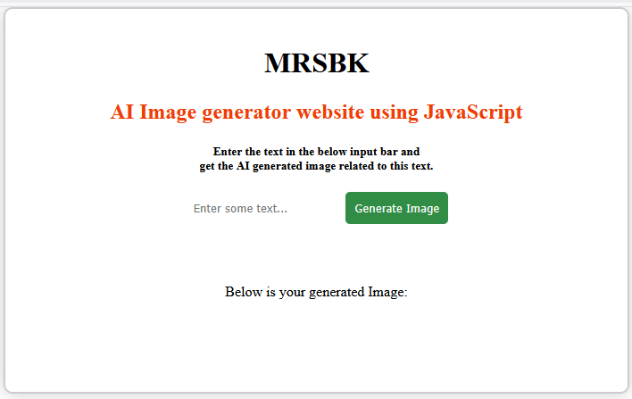

# # AI-Image-Generator-Website

## Overview

AI-Image-Generator-Website is a simple web application that allows users to generate images based on text input using the Unsplash Source API. The project is built with HTML, CSS, and JavaScript, providing an interactive interface for users to enter a prompt and view a related image.

[
    {
        "type": "command",
        "details": {
            "key": "_markdown.openImage"
        }
    }
]
## Features

- **Text-based Image Generation:** Enter any text and get a related image fetched from Unsplash.
- **Responsive Design:** Works well on both desktop and mobile devices.
- **User-friendly Interface:** Simple form for input and clear display of results.
- **No API Key Required:** Uses Unsplash Source API, which does not require authentication.

## How It Works

1. The user enters a prompt (e.g., "cat", "mountain", "sunset") in the input field.
2. Upon submitting the form, the app fetches an image from Unsplash related to the entered text.
3. The fetched image is displayed below the input form.

## Project Structure

- [`index.html`](index.html)  
  Main HTML file containing the structure of the web page.

- [`style.css`](style.css)  
  CSS file for styling the page and making it responsive.

- [`index.js`](index.js)  
  JavaScript file handling form submission and image fetching logic.

- [`README.md`](README.md)  
  Project documentation.

## Usage

1. Clone or download the repository.
2. Open `index.html` in your web browser.
3. Enter a prompt in the input field and click "Generate Image".
4. View the generated image below the form.

## Code Explanation

- **HTML ([`index.html`](index.html))**  
  Contains the main layout, including headings, input form, and image display section.

- **CSS ([`style.css`](style.css))**  
  Styles the containers, form, buttons, and images for a clean and responsive look.

- **JavaScript ([`index.js`](index.js))**  
  Handles form submission, validates input, constructs the Unsplash API URL, and updates the DOM with the fetched image.

  Key function: [`fetchImages`](index.js)  
  - Takes the user input and fetches an image from Unsplash.
  - Updates the UI with the image or error messages.

## Example

Enter "forest" in the input field and click "Generate Image" to see a forest image.

## License

This project is open source and free to use.

## Credits

-